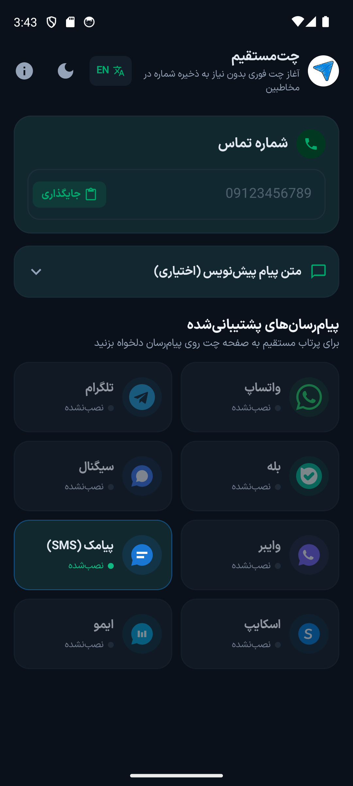
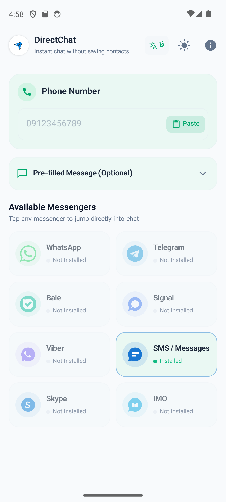
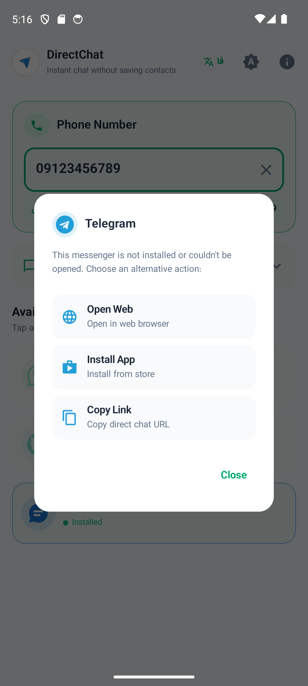
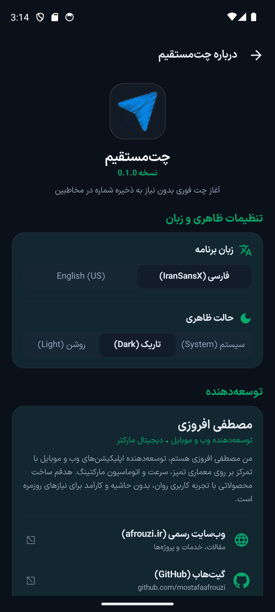
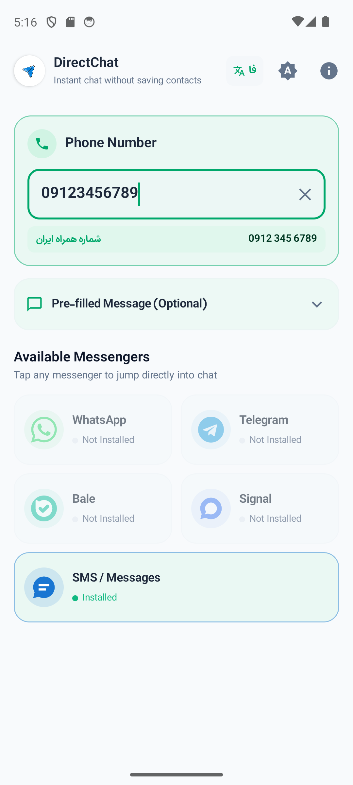
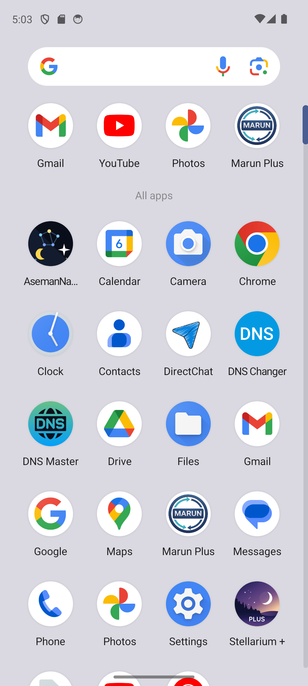

# چت‌مستقیم (DirectChat)

<div align="center">


[](https://github.com/mostafaafrouzi/DirectChat/actions)
[](https://github.com/mostafaafrouzi/DirectChat/releases/latest)
[-brightgreen.svg)](https://android.com)
[](https://kotlinlang.org)
[](https://developer.android.com/jetpack/compose)
[](https://opensource.org/licenses/MIT)

**اپلیکیشن اندروید بومی، سبک و مدرن برای آغاز چت فوری با هر شماره تلفن در تمامی پیام‌رسان‌های معتبر، بدون نیاز به ذخیره شماره در مخاطبین.**

[English Documentation](README.en.md) | [دانلود نسخه رسمی APK](https://github.com/mostafaafrouzi/DirectChat/releases/latest) | [گزارش خطا و پیشنهادات](https://github.com/mostafaafrouzi/DirectChat/issues)

</div>

---

## 🚀 ایده محوری و حل مسئله

برای ارسال یک پیام کوتاه، استعلام قیمت یا هماهنگی موقت با یک شماره در واتساپ، تلگرام یا سایر پیام‌رسان‌ها، کاربر ناچار است ابتدا آن شماره را در دفترچه تلفن گوشی ذخیره کند، چند ثانیه صبر کند تا مخاطب همگام‌سازی شود، چت را در برنامه مقصد پیدا کرده و پیام دهد و در نهایت مخاطب بی‌استفاده را از گوشی حذف کند.

**«چت‌مستقیم»** این فرآیند طولانی را به یک کلیک ساده تبدیل کرده است:
1. شماره را وارد یا با دکمه هوشمند **جایگذاری (Paste)** درج کنید.
2. پیام‌رسان مورد نظرتان را لمس کنید.
3. بلافاصله به صفحه گفتگوی مستقیم با همان شماره پرتاب شوید!

---

## ✨ قابلیت‌های کلیدی

### ۱. آغاز چت مستقیم بدون ذخیره مخاطب
- ارسال سریع پیام بدون نیاز به پر کردن دفترچه تلفن با شماره‌های موقت و غریبه.
- حفظ حریم خصوصی: وضعیت‌ها (Status)، عکس پروفایل و آخرین بازدید شما برای افراد ناشناس نمایان نمی‌شود.

### ۲. پشتیبانی هدفمند از ۵ پیام‌رسان معتبر و فعال
طراحی شکیل و استاندارد شامل ۵ پیام‌رسان ۱۰۰٪ کاربردی و تضمین‌شده:
- **واتساپ (WhatsApp):** پشتیبانی تجمیعی از واتساپ اصلی و واتساپ بیزینس بر پایه پروتکل استاندارد `wa.me`.
- **تلگرام (Telegram):** پشتیبانی تجمیعی از نسخه اصلی گوگل‌پلی، تلگرام رسمی مستقیم (Direct APK) و پلاس مسنجر با اتصال مستقیم به صفحه چت کاربر (`tg://resolve`).
- **بله (Bale):** پیام‌رسان بانکی و ارتباطی با الگوی رسمی اتصال مستقیم با شماره همراه (`ble.ir/98...`).
- **سیگنال (Signal):** امن‌ترین پیام‌رسان رمزگذاری‌شده جهان با پروتکل رسمی دیپ‌لینک شماره تلفن (`signal.me/#p/+...`).
- **پیامک پیش‌فرض گوشی (Messages / SMS):** کارت عریض و مستقل اینتنت سیستمی برای ۱۰۰٪ دستگاه‌های اندرویدی حتی بدون اتصال اینترنت.

### ۳. تجمیع هوشمند نسخه‌ها با دیالوگ انتخاب (Variant Chooser)
- به جای شلوغ کردن صفحه با کارت‌های مجزا، نسخه‌های واتساپ و تلگرام در یک کارت شکیل تجمیع شده‌اند.
- در صورت نصب بودن هم‌زمان چند نسخه (مثلاً واتساپ اصلی و بیزینس)، با لمس کارت یک دیالوگ مدرن باز شده و نسخه دلخواه را از شما می‌پرسد. در صورت نصب تنها یک نسخه، برنامه بدون معطلی اجرا می‌شود.

### ۴. دکمه‌های هوشمند جایگذاری (Paste) و پاک‌سازی (Clear)
- دکمه شیک و برجسته **جایگذاری** درون فیلد ورودی شماره برای درج سریع شماره کپی‌شده با یک تپ.
- تبدیل خودکار به دکمه **پاک‌کردن (Clear)** به محض ورود شماره.
- تشخیص خودکار شماره کپی‌شده در کلیپ‌بورد به محض باز شدن اپلیکیشن.

### ۵. پیش‌نویس پیام متنی اختیاری (Pre-filled Message)
- امکان تایپ متن پیام، سلام یا استعلام پیش از ورود به پیام‌رسان و انتقال مستقیم آن به کادر نوشتن چت (پشتیبانی‌شده در واتساپ و SMS طبق قابلیت‌های پلتفرم‌ها).

### ۶. تایپوگرافی اصیل با فونت ایران‌سنس ایکس (IRANSansX Eco)
- یکپارچه‌سازی تایپوگرافی رسمی فونت خانواده **ایران‌سنس ایکس اکو** برای متون فارسی.
- چیدمان کامل و استاندارد راست‌به‌چپ (RTL) برای فارسی و چپ‌به‌راست (LTR) برای انگلیسی.

### ۷. کنترل‌های مدرن تنظیمات تم و زبان سبک اپل (Apple iOS HIG)
- کامپوننت اسلایدی انیمیشنی (Segmented Control) با فیدبک نرم برای انتخاب تم (روشن، تاریک عمیق OLED، یا هماهنگ با سیستم).
- امکان تغییر زبان برنامه بین فارسی و انگلیسی به صورت آنی و بدون نیاز به راه‌اندازی مجدد اپلیکیشن.
- دسترسی سریع به تغییر تم و زبان با دکمه‌های میانبر بالای صفحه اصلی.

### ۸. مکانیزم فال‌بک ضدکرش (Smart Fallback)
- چنانچه پیام‌رسان انتخابی روی دستگاه نصب نباشد، اپلیکیشن به هیچ وجه کرش نمی‌کند؛ بلکه دیالوگ راهنمایی شامل باز کردن نسخه تحت وب، صفحه دانلود از استور رسمی (گوگل‌پلی/کافه‌بازار/مایکت) یا کپی لینک مستقیم گفتگو را در اختیارتان می‌گذارد.

---

## 📸 گالری تصاویر

<div align="center">

| صفحه اصلی (تم تیره - فارسی) | صفحه اصلی (تم روشن - انگلیسی) | انتخاب نسخه برنامه |
| :---: | :---: | :---: |
|  |  |  |

| تنظیمات تم و زبان (سبک iOS) | تایپ شماره و پیش‌نویس پیام | آیکون برنامه در لانچر |
| :---: | :---: | :---: |
|  |  |  |

</div>

---

## 🔒 حریم خصوصی و امنیت

- **۱۰۰٪ بدون تبلیغات:** هیچ‌گونه بنر، تبلیغ بین‌صفحه‌ای یا نوتیفیکیشن تبلیغاتی وجود ندارد.
- **بدون ترکر و آنالیتیکس:** هیچ ابزار رهگیری، Firebase Analytics یا ارسال داده به سرور ثالث در برنامه استفاده نشده است.
- **کاملاً آفلاین و ایمن:** این اپلیکیشن حتی درخواست دسترسی اینترنت (`android.permission.INTERNET`) در مانیفست ندارد و تمام عملیات مستقیماً در بستر سیستم‌عامل انجام می‌شود.
- **عدم ذخیره شماره‌ها:** شماره‌های واردشده در هیچ دیتابیس یا سروری ذخیره نمی‌شوند.

---

## 🛠️ مشخصات فنی (Technical Specs)

<div dir="ltr">

| مشخصه | مقدار |
| :--- | :--- |
| **Application ID** | `com.afrouzi.directchat` |
| **Minimum SDK** | `26` (Android 8.0 Oreo) |
| **Target / Compile SDK** | `35` (Android 15) |
| **Kotlin Version** | `2.0.21` |
| **Jetpack Compose BOM** | `2024.10.01` (Material 3) |
| **Architecture** | Single-Activity MVVM + StateFlow + DataStore |
| **Release Version** | `1.0.0` |
| **Version Code** | `1` |
| **Signing Scheme** | RSA 4096-bit / APK Signature Scheme v2 |

</div>

---

## 📦 بیلد و راه‌اندازی محلی

برای کامپایل و تست پروژه در محیط توسعه محلی:

```bash
# کلون مخزن
git clone https://github.com/mostafaafrouzi/DirectChat.git
cd DirectChat

# اجرای تست‌های واحد
./gradlew test

# بیلد نسخه دیباگ
./gradlew assembleDebug

# بیلد نسخه ریلیز نهایی
./gradlew assembleRelease

# نصب مستقیم روی امولاتور یا گوشی متصل با ADB
adb install -r app/build/outputs/apk/release/app-release.apk
```

---

## ⬇️ دریافت آخرین نسخه

- **صفحه انتشار گیت‌هاب:** [دانلود مستقیم فایل APK و AAB نسخه رسمی 1.0.0](https://github.com/mostafaafrouzi/DirectChat/releases/latest)

---

## 👨‍💻 سازنده و توسعه‌دهنده

طراحی و توسعه داده شده توسط **مصطفی افروزی**:

* 🌐 **وب‌سایت رسمی:** [afrouzi.ir](https://afrouzi.ir/?utm_source=directchat&utm_medium=github_readme&utm_campaign=directchat)
* 🐙 **گیت‌هاب:** [github.com/mostafaafrouzi](https://github.com/mostafaafrouzi)
* 💼 **لینکدین:** [linkedin.com/in/mostafaafrouzi](https://linkedin.com/in/mostafaafrouzi)
* 🛍️ **سایر برنامه‌ها در کافه‌بازار:** [پروفایل بازار](https://cafebazaar.ir/developer/057657612999)
* 📱 **سایر برنامه‌ها در مایکت:** [پروفایل مایکت](https://myket.ir/developer/dev-102174)

---

## 📄 لایسنس

این پروژه تحت مجوز متن‌باز [MIT License](LICENSE) منتشر شده است.
